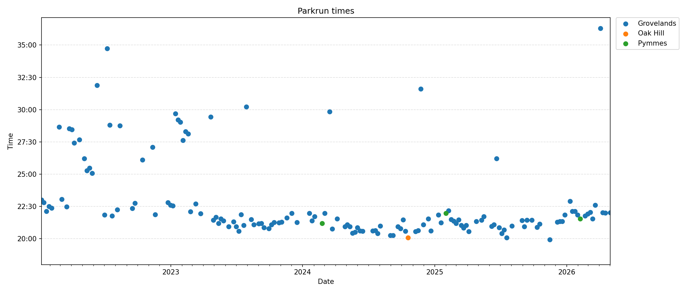
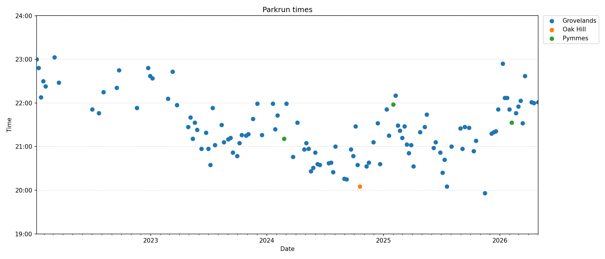

# Parkrun times

This repo contains charts of my park run times.

The data is fetched from the
park run website using the script `fetch_results.py`. The charts are generated
using the `matplotlib` library.

## Usage

Run `uv run fetch_results.py` to regenerate the charts and update
`README.md`.

## Charts

All results.

Results excluding outliers (normally where I ran with one of my children):

